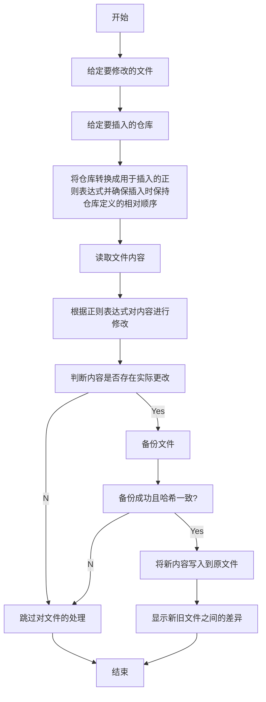
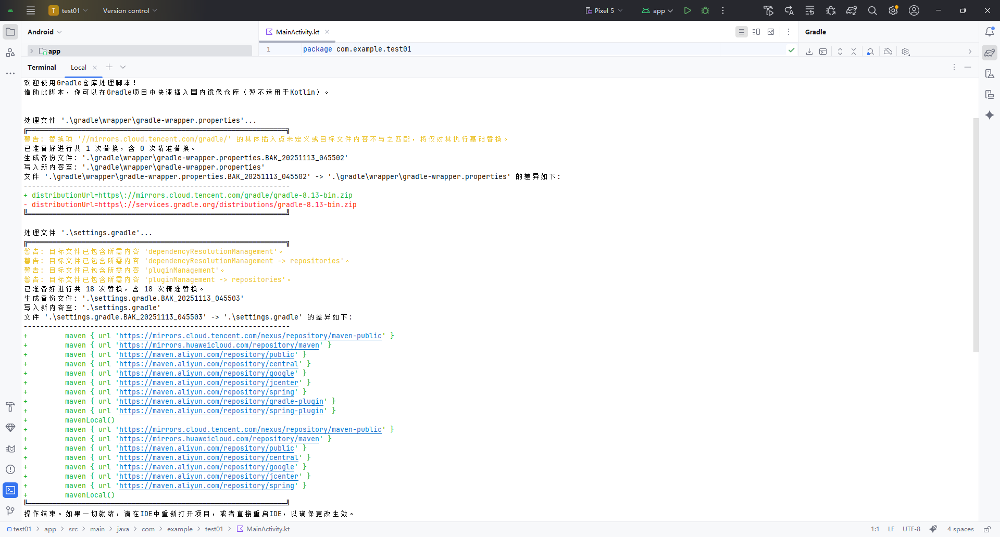

# gradle-init
gradle-init 是一个用于快速初始化 Gradle 项目仓库的 PowerShell 脚本工具。借助此工具，你可以在 Gradle 项目中快速插入国内镜像仓库（暂不适用于Kotlin），这对于 Android Studio 项目很有用（个人认为）。

## 设计背景

由于 Android Studio 创建的项目默认不支持 Gradle 全局初始化脚本中的仓库定义，且只信任 `settings.gradle` 中的配置，导致国内镜像仓库的使用非常不便。即对于每个新创建的项目都只能默认使用官方仓库，要添加国内的镜像仓库，就得每个项目都自行配置一遍，显得极其繁琐。于是便萌生了自动化配置 Gradle 仓库的想法，然后这个工具便诞生了。

## 脚本的功能

- 备份并修改 `项目文件夹\gradle\wrapper\gradle-wrapper.properties` 文件，替换 Gradle 程序本体的下载地址为腾讯云镜像仓库的地址；

  > 对于新项目，在修改 `gradle-wrapper.properties` 文件中的 `distributionUrl` 属性并重新打开项目之前， Android Studio 仍会尝试从官方地址下载 Gradle 程序本体，除非已经从官方地址下载完成过。

- 备份并修改 `项目文件夹\settings.gradle` 文件，针对插件和依赖，插入阿里云、腾讯云、华为云等平台提供的镜像仓库；

  > 这是 Android Studio 推荐的仓库配置方式。

- 备份并修改 `项目文件夹\build.gradle` 文件，插入阿里云、腾讯云、华为云等平台提供的镜像仓库

  > 由于 Android Studio 只信任 `settings.gradle` 文件中的仓库定义，故默认禁用此功能，可手动开启。
  >
  > 当然了，也可以手动注释掉 `settings.gradle` 文件中 `dependencyResolutionManagement` 内的 `repositoriesMode.set(RepositoriesMode.FAIL_ON_PROJECT_REPOS)`，使得外部定义的仓库可用。

## 大致工作逻辑



## 使用方法

### 1. 根据需要适当调整相关设置

例如以下设置：

> 说明：
>
> 可以通过调整 `$SettingsRepoList` 数组中各元素的顺序来调整各“仓库”的插入顺序，对于目标文件中已经存在的部分仓库，本工具将忽略它，不出意外的话不会造成仓库重复。
>
> 该数组中的元素，其类型为哈希表，此哈希表接受如下键值对：
>
> - scope：仓库的作用范围。
>
>   > 3个值可选，分别是 `plugin`、`dependency` 和 `root`，分别对应于 `pluginManagement -> repositories`、`dependencyResolutionManagement -> repositories`、`repositories`；
>
> - value：仓库的值。
>
>   > 可以是仓库的 URL 地址（比如 `https://maven.aliyun.com/repository/public`），也可以是仓库的完整表示（比如 `mavenLocal()`、`mavenCentral()`、`maven { url 'https://maven.aliyun.com/repository/public' }` 等等）；
>
> - type：仓库值的类型。
>
>   > 如果 `value` 指的是仓库的 URL 地址，请填入 `RepoUrl`；如果指的是仓库的完整表示，请填入 `Repo`。
>
> 如果认为有必要对 `build.gradle` 文件也进行修改，可将 `$IS_BUILD_FILE_REQUIRED` 变量设置为 `$true`，并按照调整 `$SettingsRepoList` 数组的类似方法对 `$BuildRepoList` 数组进行调整。

> 注意事项：仓库数组变量中，各scope最后一项仅用于定位插入点（插到google仓库前面），不会被实际添加到文件，请勿删除。

```powershell
# ================================函数公共变量部分================================
$IS_WRAPPER_FILE_REQUIRED=$true     # 是否需要处理wrapper文件
$IS_SETTINGS_FILE_REQUIRED=$true    # 是否需要处理settings文件
$IS_BUILD_FILE_REQUIRED=$false      # 是否需要处理build文件（Android Studio默认只信任settings文件）
# ================================替换内容定义部分================================
# ****************仓库变量定义****************
# settings.gradle文件中要插入的仓库（按预期的插入先后顺序依次排列）
$SettingsRepoList=@(
    # 插件仓库
    @{ scope='plugin';      type='RepoUrl'; value=$REPO_TENCENT_PUBLIC },
    @{ scope='plugin';      type='RepoUrl'; value=$REPO_HUAWEI_PUBLIC },
    @{ scope='plugin';      type='RepoUrl'; value=$REPO_ALI_PUBLIC },
    @{ scope='plugin';      type='RepoUrl'; value=$REPO_ALI_CENTRAL },
    @{ scope='plugin';      type='RepoUrl'; value=$REPO_ALI_GOOGLE },
    @{ scope='plugin';      type='RepoUrl'; value=$REPO_ALI_JCENTER },
    @{ scope='plugin';      type='RepoUrl'; value=$REPO_ALI_SPRING },
    @{ scope='plugin';      type='RepoUrl'; value=$REPO_ALI_GRADLE_PLUGIN },
    @{ scope='plugin';      type='RepoUrl'; value=$REPO_ALI_SPRING_PLUGIN },
    @{ scope='plugin';      type='Repo';    value=$REPO_LOCAL },
    # 依赖仓库
    @{ scope='dependency';  type='RepoUrl'; value=$REPO_TENCENT_PUBLIC },
    @{ scope='dependency';  type='RepoUrl'; value=$REPO_HUAWEI_PUBLIC },
    @{ scope='dependency';  type='RepoUrl'; value=$REPO_ALI_PUBLIC },
    @{ scope='dependency';  type='RepoUrl'; value=$REPO_ALI_CENTRAL },
    @{ scope='dependency';  type='RepoUrl'; value=$REPO_ALI_GOOGLE },
    @{ scope='dependency';  type='RepoUrl'; value=$REPO_ALI_JCENTER },
    @{ scope='dependency';  type='RepoUrl'; value=$REPO_ALI_SPRING },
    @{ scope='dependency';  type='Repo';    value=$REPO_LOCAL },
    # 各scope最后一项仅用于定位插入点，不会被实际添加到文件，请勿删除
    @{ scope='plugin';      type='Repo';    value="google[\s({]" }, # 左圆括号、左花括号将被自动转义
    @{ scope='dependency';  type='Repo';    value="google[\s({]" } # 左圆括号、左花括号将被自动转义
)
# build.gradle文件中要插入的仓库（按预期的插入先后顺序依次排列）
$BuildRepoList=@(
    # 根仓库
    @{ scope='root';        type='RepoUrl'; value=$REPO_TENCENT_PUBLIC },
    @{ scope='root';        type='RepoUrl'; value=$REPO_HUAWEI_PUBLIC },
    @{ scope='root';        type='RepoUrl'; value=$REPO_ALI_PUBLIC },
    @{ scope='root';        type='RepoUrl'; value=$REPO_ALI_CENTRAL },
    @{ scope='root';        type='RepoUrl'; value=$REPO_ALI_GOOGLE },
    @{ scope='root';        type='RepoUrl'; value=$REPO_ALI_JCENTER },
    @{ scope='root';        type='RepoUrl'; value=$REPO_ALI_SPRING },
    @{ scope='root';        type='RepoUrl'; value=$REPO_ALI_GRADLE_PLUGIN },
    @{ scope='root';        type='RepoUrl'; value=$REPO_ALI_SPRING_PLUGIN },
    @{ scope='root';        type='Repo';    value=$REPO_LOCAL },
    # 各scope最后一项仅用于定位插入点，不会被实际添加到文件，请勿删除
    @{ scope='root';        type='Repo';    value="google[\s({]" } # 左圆括号、左花括号将被自动转义
)
```


### 2. 将本工具移动到适当位置，并将所在路径添加到 `PATH` 环境变量

PS脚本才是主程序，bat只是个启动器。二者需要存放到同一路径下才能正常运行。

为了方便调用，建议将本工具所在路径添加到 `PATH` 环境变量。

### 3. 切换到需要操作的项目路径，运行本工具即可

```powershell
cd path/to/your-gradle-project
gradle-init
```

它将产生类似于如下输出：

```
欢迎使用Gradle仓库处理脚本！
借助此脚本，你可以在Gradle项目中快速插入国内镜像仓库（暂不适用于Kotlin）。


处理文件 '.\gradle\wrapper\gradle-wrapper.properties'...
╔══════════════════════════════════════════════════════════════╗
警告: 替换项 '//mirrors.cloud.tencent.com/gradle/' 的具体插入点未定义或目标文件内容不与之匹配，将仅对其执行基础替换。
已准备好进行共 1 次替换，含 0 次精准替换。
生成备份文件: '.\gradle\wrapper\gradle-wrapper.properties.BAK_20251113_045502'
写入新内容至: '.\gradle\wrapper\gradle-wrapper.properties'
文件 '.\gradle\wrapper\gradle-wrapper.properties.BAK_20251113_045502' -> '.\gradle\wrapper\gradle-wrapper.properties' 的差异如下: 
----------------------------------------------------------------
+ distributionUrl=https\://mirrors.cloud.tencent.com/gradle/gradle-8.13-bin.zip
- distributionUrl=https\://services.gradle.org/distributions/gradle-8.13-bin.zip
╚══════════════════════════════════════════════════════════════╝

处理文件 '.\settings.gradle'...
╔══════════════════════════════════════════════════════════════╗
警告: 目标文件已包含所需内容 'dependencyResolutionManagement'。
警告: 目标文件已包含所需内容 'dependencyResolutionManagement -> repositories'。
警告: 目标文件已包含所需内容 'pluginManagement'。
警告: 目标文件已包含所需内容 'pluginManagement -> repositories'。
已准备好进行共 18 次替换，含 18 次精准替换。
生成备份文件: '.\settings.gradle.BAK_20251113_045503'
写入新内容至: '.\settings.gradle'
文件 '.\settings.gradle.BAK_20251113_045503' -> '.\settings.gradle' 的差异如下:
----------------------------------------------------------------
+         maven { url 'https://mirrors.cloud.tencent.com/nexus/repository/maven-public' }
+         maven { url 'https://mirrors.huaweicloud.com/repository/maven' }
+         maven { url 'https://maven.aliyun.com/repository/public' }
+         maven { url 'https://maven.aliyun.com/repository/central' }
+         maven { url 'https://maven.aliyun.com/repository/google' }
+         maven { url 'https://maven.aliyun.com/repository/jcenter' }
+         maven { url 'https://maven.aliyun.com/repository/spring' }
+         maven { url 'https://maven.aliyun.com/repository/gradle-plugin' }
+         maven { url 'https://maven.aliyun.com/repository/spring-plugin' }
+         mavenLocal()
+         maven { url 'https://mirrors.cloud.tencent.com/nexus/repository/maven-public' }
+         maven { url 'https://mirrors.huaweicloud.com/repository/maven' }
+         maven { url 'https://maven.aliyun.com/repository/public' }
+         maven { url 'https://maven.aliyun.com/repository/central' }
+         maven { url 'https://maven.aliyun.com/repository/google' }
+         maven { url 'https://maven.aliyun.com/repository/jcenter' }
+         maven { url 'https://maven.aliyun.com/repository/spring' }
+         mavenLocal()
╚══════════════════════════════════════════════════════════════╝
操作结束。如果一切就绪，请在IDE中重新打开项目，或者直接重启IDE，以确保更改生效。
```

### 4. 在IDE中重新打开项目，或者直接重启IDE，以确保更改生效

为使更改后的内容能够起作用，通常需要在IDE中重新打开项目，以便新配置得到加载。

### 5. 检查IDE的构建窗口，确保已经开始从镜像仓库下载依赖。

嗯。就是这样。

## 运行效果


